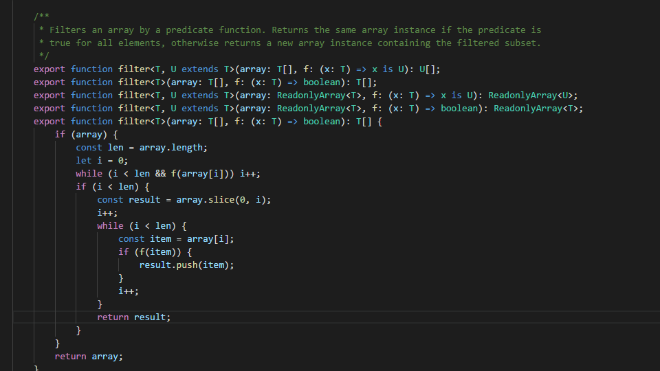

# Smart Column Indenter

This extension adds support for indenting code into columns, to make your code more beautiful, readable, clear and with fewer lines of code.

The work is in progress at the github repository: https://github.com/lmcarreiro/smart-column-indenter

## Features

1. **Indent into 2 Columns (Ctrl+I Ctrl+J)** Used in key-value pair which the values aren't similar.
2. **Indent into N Columns (Ctrl+I Ctrl+N)** Used in a sequence of two or more lines that are similar
3. **Remove Line Breaks (Ctrl+I Ctrl+I)** Used to remove line breaks (normally in object literals)

## Limitations

Today this extension only works with *.ts, *.js and *.json files. 

Feel free to make Pull Requests to add support to other languages and add new features.

## Release Notes

### 0.0.11

Change the gif.

### 0.0.10

Change extension tags. I realize now that the more used term is "code alignment".

### 0.0.9

Add an icon.

### 0.0.8

Add some gif to make a better presentation of the extension features.

### 0.0.7

The MVP.

### 0.0.1-0.0.6

Just proof of concept and learning how to publish extensions in VSCode.

-----------------------------------------------------------------------------------------------------------
